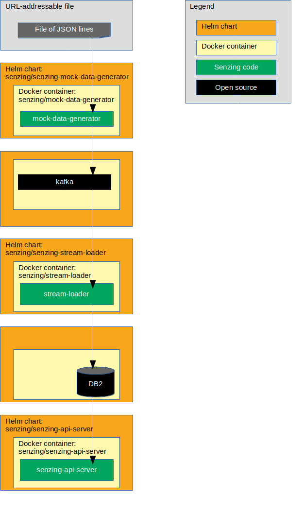

# ibm-icp4d-guide

## Overview

This repository illustrates a reference implementation of Senzing on the IBM Cloud Private for Data.

The instructions show how to set up a system that:

1. Reads JSON lines from a file on the internet.
1. Sends each JSON line as a message to a Kafka topic.
1. Reads messages from the Kafka topic and inserts into Senzing.
    1. In this implementation, Senzing keeps its data in an IBM Db2 database.
1. Reads information from Senzing via [Senzing REST API](https://github.com/Senzing/senzing-rest-api) server.

The following diagram shows the relationship of the Helm charts, docker containers, and code in this IBM Cloud Private for Data reference implementation.



### Contents

1. [Expectations](#expectations)
    1. [Space](#space)
    1. [Time](#time)
    1. [Background knowledge](#background-knowledge)
1. [Prerequisites](#prerequisites)
    1. [Clone repository](#clone-repository)
    1. [Docker images](#docker-images)
    1. [Kafka initialization](#kafka-initialization)
    1. [Database initialization](#database-initialization)
    1. [Database connection information](#database-connection-information)
1. [Demonstrate](#demonstrate)
    1. [Set environment variables](#set-environment-variables)
    1. [Add helm repositories](#add-helm-repositories)
    1. [Deploy Senzing_API.tgz package](#deploy-senzing_apitgz-package)
    1. [Install Senzing license](#install-senzing-license)
    1. [Install mock-data-generator Helm chart](#install-mock-data-generator-helm-chart)
    1. [Install stream-loader Helm chart](#install-stream-loader-helm-chart)
    1. [Install senzing-api-server Helm chart](#install-senzing-api-server-helm-chart)
    1. [Test Senzing REST API server](#test-senzing-rest-api-server)
1. [Cleanup](#cleanup)
    1. [Delete Helm charts](#delete-helm-charts)
    1. [Delete Kafka topic](#delete-kafka-topic)
    1. [Delete database tables](#delete-database-tables)
    1. [Delete git repository](#delete-git-repository)

## Expectations

### Space

This repository and demonstration require 20 GB free disk space.

### Time

Budget 4 hours to get the demonstration up-and-running, depending on CPU and network speeds.

### Background knowledge

This repository assumes a working knowledge of:

1. [Docker](https://github.com/Senzing/knowledge-base/blob/master/WHATIS/docker.md)
1. [Kubernetes](https://github.com/Senzing/knowledge-base/blob/master/WHATIS/kubernetes.md)
1. [Helm](https://github.com/Senzing/knowledge-base/blob/master/WHATIS/helm.md)
1. [IBM ICP4D](https://github.com/Senzing/knowledge-base/blob/master/WHATIS/ibm-icp4d.md)

## Prerequisites

### Clone repository

The Git repository has files that will be used in the `helm install --values` parameter.

1. Using these environment variable values:

    ```console
    export GIT_ACCOUNT=senzing
    export GIT_REPOSITORY=ibm-icp4d-guide
    ```

1. Follow steps in [clone-repository](https://github.com/Senzing/knowledge-base/blob/master/HOWTO/clone-repository.md) to install the Git repository.

1. After the Git repository has been cloned, be sure the following environment variables are set:

    ```console
    export GIT_ACCOUNT_DIR=~/${GIT_ACCOUNT}.git
    export GIT_REPOSITORY_DIR="${GIT_ACCOUNT_DIR}/${GIT_REPOSITORY}"
    ```
    ```
1.  The following IBM documentation describes what is requuired in order to enable the ICP4D image policy to accept the creation of helm charts and pods pulled from github.io:
```
https://www.ibm.com/support/knowledgecenter/en/SSBS6K_3.1.0/manage_images/image_security.html
```
It shows you create a policy.yaml file as follows:
```
apiVersion: securityenforcement.admission.cloud.ibm.com/v1beta1
kind: ClusterImagePolicy
metadata:
  name: senzingaddon
  namespace: zen
spec:
 repositories:
 # Docker hub Container Registry
  - name: "docker.io/*"
    policy:
```
Next, you issue 'kubectl apply -f policy.yaml'
```    

### Docker images

1. **FIXME:**  Describe how to accept terms and conditions for the senzing/senzing-package docker image.

### Kafka initialization

1. Find pod running kafka.  Example:

    ```console
    kubectl get pods -n zen | grep kafka
    ```

1. Enter the pod.  Example:

    ```console
    kubectl exec -it kafka-0 -n zen  -- /bin/bash
    ```

1. Within the Kafka pod, create Kafka topic for Senzing.  Example:

    ```console
    /opt/kafka/bin/kafka-topics.sh \
      --create \
      --zookeeper zookeeper:2181/kafka \
      --replication-factor 1 \
      --partitions 50 \
      --topic senzing-kafka-topic
    ```

    1. "50" partitions was chosen because a 5-to-1 ratio
       of Kafka partitions to Senzing "stream-loaders" is recommended.
       Below, 10 Senzing "stream loaders" will be created.

1. Within the Kafka pod, verify the Kafka topic has been created.  Example:

    ```console
    /opt/kafka/bin/kafka-topics.sh \
      --list \
      --zookeeper zookeeper:2181/kafka
    ```

1. Outside of the Kafka pod, find the running Kafka services.  Example:

    ```console
    kubectl get service --namespace zen | grep kafka
    ```

1. Outside of the Kafka pod, identify the service host with type of `NodePort`.  Example:

    ```console
    export KAFKA_HOST=kafka-external

    echo ${KAFKA_HOST}
    ```

### Database initialization

#### Obtain correct SQL file

1. For **IBM Db2** use one of these techniques:
    1. In local git clone at `${GIT_REPOSITORY_DIR}/sql/g2core-schema-db2-create.sql`
    1. [On GitHub](https://github.com/Senzing/ibm-icp4d-guide/blob/issue-1.dockter.1/sql/g2core-schema-db2-create.sql)
    1. Using `curl`.  Example:

        ```console
        curl -X GET \
          --output /tmp/g2core-schema-db2-create.sql \
          https://raw.githubusercontent.com/Senzing/ibm-icp4d-guide/issue-1.dockter.1/sql/g2core-schema-db2-create.sql
        ```

1. For **IBM Db2 BLU** use one of these techniques:
    1. In local git clone at `${GIT_REPOSITORY_DIR}/sql/g2core-schema-db2-BLU-create.sql`
    1. [On GitHub](https://github.com/Senzing/ibm-icp4d-guide/blob/issue-1.dockter.1/sql/g2core-schema-db2-BLU-create.sql)
    1. Using `curl`.  Example:

        ```console
        curl -X GET \
          --output /tmp/g2core-schema-db2-BLU-create.sql \
          https://raw.githubusercontent.com/Senzing/ibm-icp4d-guide/issue-1.dockter.1/sql/g2core-schema-db2-BLU-create.sql
        ```

#### Run SQL file

1. Variation #1. Create tables in the database using command line.  Example:

    1. If needed, create a database for Senzing data.  Example:

        ```console
        su - db2inst1
        export DB2_DATABASE=g2

        source sqllib/db2profile
        db2 create database ${DB2_DATABASE} using codeset utf-8 territory us
        ```

    1. Create tables in schema.  Example:

        ```console
        su - db2inst1
        export DB2_DATABASE=g2
        export DB2_USER=db2inst1

        source sqllib/db2profile
        db2 connect to ${DB2_DATABASE} user ${DB2_USER}
        ```

        Submit password.

        ```console
        db2 -tvf g2core-schema-db2-create.sql
        db2 terminate
        ```

1. Variation #2.  **FIXME:** Using the IBM Cloud Private for Data console with DB2 Advanced ...
    1. Home > My data > Databases
        1. Open tile for desired database
        1. Click on the ellipse, click on "Open"
        1. Menu > Run SQL
        1. Click on plus sign ("+") to add
        1. Select appropriate Schema (check the box)
        1. From file
        1. In file browser, navigate to SQL file
        1. Click "Run all" button

### Database tuning

**FIXME:** Continue to improve.

1. For information on tuning the database for optimum performance, see
   [Tuning your Database](https://senzing.zendesk.com/hc/en-us/articles/360016288254-Tuning-your-Database).

1. Additional tuning parameters to try:

    ```console
    db2set DB2_USE_ALTERNATE_PAGE_CLEANING=ON
    db2set DB2_APPENDERS_PER_PAGE=1
    db2set DB2_INLIST_TO_NLJN=YES
    db2set DB2_LOGGER_NON_BUFFERED_IO=ON
    db2set DB2_SKIP_LOG_WAIT=YES
    db2set DB2_APM_PERFORMANCE=off
    db2set DB2_SKIPLOCKED_GRAMMAR=YES
    ```

1. XXX

    ```console
    db2 connect to ${DB2_DATABASE} user ${DB2_USER}

    db2 UPDATE SYS_SEQUENCE SET CACHE_SIZE=100000
    db2 commit
    ```

### Database connection information

1. Craft the `SENZING_DATABASE_URL`.  It will be used in "helm values" files.

    Components of the URL:

    ```console
    export DATABASE_USERNAME=<my-username>
    export DATABASE_PASSWORD=<my-password>
    export DATABASE_HOST=<hostname>
    export DATABASE_PORT=<db2-connnection-port>
    export DATABASE_DATABASE=<database-name>
    ```

    :pencil2: Set environment variables.  Example:

    ```console
    export DATABASE_USERNAME=johnsmith
    export DATABASE_PASSWORD=secret
    export DATABASE_HOST=my.database.com
    export DATABASE_PORT=50000
    export DATABASE_DATABASE=G2
    ```

    Construct database URL.  Example:

    ```console
    export SENZING_DATABASE_URL="db2://${DATABASE_USERNAME}:${DATABASE_PASSWORD}@${DATABASE_HOST}:${DATABASE_PORT}/${DATABASE_DATABASE}"

    echo ${SENZING_DATABASE_URL}
    ```

1. **FIXME:** In the user interface, (show how to find database credentials)
    1. Details
    1. Bottom
    1. "Access Information" section

## Demonstrate

### Set environment variables

1. Environment variables that need customization.  Example:

    ```console
    export DEMO_NAMESPACE=zen
    ```

1. If using Transport Layer Security (TLS), then set the following environment variable:

    ```console
    export HELM_TLS="--tls"
    ```

### Add helm repositories

1. Add Senzing Helm repository.  Example:

    ```console
    helm repo add senzing https://senzing.github.io/charts/
    ```

1. Optional:  View Senzing Helm charts in repository.  Example:

    ```console
    helm search senzing/
    ```

1. References:
    1. [Senzing charts](https://github.com/Senzing/charts)

### Deploy Senzing_API.tgz package

1. Deploy the contents of
   [Senzing_API.tgz](https://github.com/Senzing/knowledge-base/blob/master/WHATIS/senzing-api-tgz.md)
   onto a Kubernetes Persistent Volume.

   References:
    1. [GitHub repository](https://github.com/Senzing/senzing-package)
    1. [Helm chart](https://github.com/Senzing/charts/tree/master/charts/senzing-package)
    1. [Docker](https://hub.docker.com/r/senzing/senzing-package)

1. :pencil2: Review helm values in `${GIT_REPOSITORY_DIR}/helm-values/senzing-package.yaml`.
    1. `senzing.optSenzingClaim` is the Persistent Volume Claim for use by Senzing as `/opt/senzing`.

1. Perform Helm install.  Example:

    ```console
    helm install ${HELM_TLS} \
      --name senzing-package \
      --namespace ${DEMO_NAMESPACE} \
      --values ${GIT_REPOSITORY_DIR}/helm-values/senzing-package.yaml \
      senzing/senzing-package
    ```

1. **Important:** Wait until job runs to completion before continuing.
   This will take a few minutes.  Example:

    ```console
    watch -n 5 -d "kubectl get pods --namespace ${DEMO_NAMESPACE} | grep senzing"
    ```

   Example of completed job:

    ```console
    senzing-package-r6z86               0/1     Completed   0          4m29s
    ```

    Note that the job in the example took four and a half minutes to complete.

### Install senzing-debug Helm Chart

This deployment will be used later to:
    * Inspect the `/opt/senzing` volume
    * Copy files onto the Persistent Volume
    * Debug issues

1. :pencil2: Review helm values in `${GIT_REPOSITORY_DIR}/helm-values/senzing-debug.yaml`.
    1. `senzing.databaseUrl` is the value of ${SENZING_DATABASE_URL}.
    1. `senzing.optSenzingClaim` is the Persistent Volume Claim for use by Senzing as `/opt/senzing`.

1. Install chart.  Example:

    ```console
    helm install ${HELM_TLS} \
      --name senzing-debug \
      --namespace ${DEMO_NAMESPACE} \
      --values ${GIT_REPOSITORY_DIR}/helm-values/senzing-debug.yaml \
       senzing/senzing-debug
    ```

1. :pencil2: Find and enter pod.  Example:

    ```console
    kubectl get pods --namespace ${DEMO_NAMESPACE}
    export DEBUG_POD_NAME=senzing-debug-XXXXXX
    kubectl exec -it --namespace ${DEMO_NAMESPACE} ${DEBUG_POD_NAME} -- /bin/bash
    ```

### Install Senzing license

This is an optional step.
Senzing comes with a trial license that supports 10,000 records.
If this is sufficient, there is no need to install a new license
and this step may be skipped.

1. If working with more than 10,000 records,
   [obtain a Senzing license](https://github.com/Senzing/knowledge-base/blob/master/HOWTO/obtain-senzing-license.md).

1. Be sure the `senzing-debug` Helm Chart has been installed.
   See "[Install senzing-debug Helm Chart](#install-senzing-debug-helm-chart)".

1. Copy the `g2.lic` file to the `senzing-debug` pod
   at `/opt/senzing/g2/data/g2.lic`.

    :pencil2: Identify location of `g2.lic` on local workstation.  Example:

    ```console
    export G2_LICENSE_PATH=/path/to/local/g2.lic
    ```

    Copy file to debug pod.  Example:

    ```console
    kubectl cp \
      --namespace ${DEMO_NAMESPACE} \
      ${G2_LICENSE_PATH} \
      ${DEBUG_POD_NAME}:/opt/senzing/g2/data/g2.lic
    ```

1. Note: `/opt/senzing` is attached as a Kubernetes Persistent Volume Claim (PVC),
   so the license will be seen by all pods that attach to the PVC.

### Install mock-data-generator Helm chart

:warning:  **FIXME:**  This is a **mock** data generator.
In production, this component is replaced by
different components that feed Kafka.

1. This component reads JSON LINES from a URL-addressable file and pushes to Kafka.

   References:
    1. [GitHub repository](https://github.com/Senzing/mock-data-generator)
    1. [Helm chart](https://github.com/Senzing/charts/tree/master/charts/senzing-mock-data-generator)
    1. [Docker](https://hub.docker.com/r/senzing/mock-data-generator)

1. :pencil2: Review helm values in `${GIT_REPOSITORY_DIR}/helm-values/mock-data-generator.yaml`.
    1. `senzing.kafkaBootstrapServerHost` is the value of ${KAFKA_HOST}.
    1. `senzing.inputUrl` is a URL addressable file of JSON LINES. (e.g. `file://`, `http://`).
    1. `senzing.recordMax` is the maximum number of JSON LINES to read from the file.
       Remove or set to 0 to read all lines.

1. Perform Helm install.  Example:

    ```console
    helm install ${HELM_TLS} \
      --name senzing-mock-data-generator \
      --namespace ${DEMO_NAMESPACE} \
      --values ${GIT_REPOSITORY_DIR}/helm-values/mock-data-generator.yaml \
      senzing/senzing-mock-data-generator
    ```

### Install stream-loader Helm chart

1. This component reads messages from a Kafka topic and sends them to Senzing which populates the DB2 database.

   References:
    1. [GitHub repository](https://github.com/Senzing/stream-loader)
    1. [Helm chart](https://github.com/Senzing/charts/tree/master/charts/senzing-stream-loader)
    1. [Docker](https://hub.docker.com/r/senzing/stream-loader)

1. :pencil2: Review helm values in `${GIT_REPOSITORY_DIR}/helm-values/stream-loader.yaml`.
    1. `senzing.databaseUrl` is the value of ${SENZING_DATABASE_URL}.
    1. `senzing.kafkaBootstrapServerHost` is the value of ${KAFKA_HOST}.
    1. `senzing.optSenzingClaim` is the Persistent Volume Claim for use by Senzing as `/opt/senzing`.

1. Perform Helm install.  Example:

    ```console
    helm install ${HELM_TLS} \
      --name senzing-stream-loader \
      --namespace ${DEMO_NAMESPACE} \
      --values ${GIT_REPOSITORY_DIR}/helm-values/stream-loader.yaml \
      senzing/senzing-stream-loader
    ```

### Install senzing-api-server Helm chart

1. This component creates an HTTP service that implements the
[Senzing REST API](https://github.com/Senzing/senzing-rest-api).

   References:
    1. [GitHub repository](https://github.com/Senzing/senzing-api-server)
    1. [Helm chart](https://github.com/Senzing/charts/tree/master/charts/senzing-api-server)
    1. [Docker](https://hub.docker.com/r/senzing/senzing-api-server)

1. :pencil2: Review helm values in `${GIT_REPOSITORY_DIR}/helm-values/senzing-api-server`.
    1. `senzing.databaseUrl` is the value of ${SENZING_DATABASE_URL}.
    1. `senzing.optSenzingClaim` is the Persistent Volume Claim for use by Senzing as `/opt/senzing`.

1. Perform Helm install.  Example:

    ```console
    helm install ${HELM_TLS} \
      --name senzing-api-server \
      --namespace ${DEMO_NAMESPACE} \
      --values ${GIT_REPOSITORY_DIR}/helm-values/senzing-api-server.yaml \
      senzing/senzing-api-server
    ```

1. Wait for pods to run.  Example:

    ```console
    watch -n 5 -d "kubectl get pods --namespace ${DEMO_NAMESPACE} | grep senzing"
    ```

1. Port forward to local machine.  Run in a separate terminal window.  Example:

    :pencil2: Set environment variables.  Example:

    ```console
    export DEMO_NAMESPACE=zen
    export SENZING_API_PORT=8889
    ```

    Port forward.  Example:

    ```console
    kubectl port-forward \
      --namespace ${DEMO_NAMESPACE} \
      svc/senzing-api-server ${SENZING_API_PORT}:80
    ```

### Test Senzing REST API server

1. Example:

    ```console
    export SENZING_API_SERVICE=http://localhost:${SENZING_API_PORT}

    curl -X GET ${SENZING_API_SERVICE}/heartbeat
    curl -X GET ${SENZING_API_SERVICE}/license
    curl -X GET ${SENZING_API_SERVICE}/entities/1
    ```

## Cleanup

### Delete Helm charts

1. Example:

    ```console
    helm delete ${HELM_TLS} --purge senzing-api-server
    helm delete ${HELM_TLS} --purge senzing-stream-loader
    helm delete ${HELM_TLS} --purge senzing-mock-data-generator
    helm delete ${HELM_TLS} --purge senzing-debug
    helm delete ${HELM_TLS} --purge senzing-package
    helm repo remove senzing
    ```

### Delete Kafka topic

1. Find pod running kafka.  Example:

    ```console
    kubectl get pods -n zen | grep kafka
    ```

1. Enter the pod.  Example:

    ```console
    kubectl exec -it kafka-0 -n zen  -- /bin/bash
    ```

1. Within the Kafka pod, delete Kafka topic for Senzing.  Example:

    ```console
    /opt/kafka/bin/kafka-topics.sh \
      --delete \
      --zookeeper zookeeper:2181/kafka \
      --topic senzing-kafka-topic
    ```

### Delete database tables

1. **FIXME:** Example:

### Delete git repository

1. Delete git repository.  Example:

    ```console
    sudo rm -rf ${GIT_REPOSITORY_DIR}
    ```
