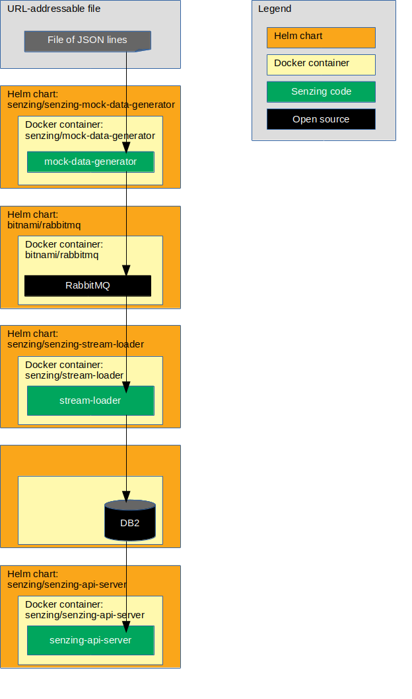

# ibm-icp4d-guide-helm-rabbitmq-db2

## Overview

This repository illustrates a reference implementation of Senzing on the IBM Cloud Pak for Data.

The instructions show how to set up a system that:

1. Reads JSON lines from a file on the internet.
1. Sends each JSON line to a message queue.
    1. In this implementation, the queue is RabbitMQ.
1. Reads messages from the queue and inserts into Senzing.
    1. In this implementation, Senzing keeps its data in an IBM Db2 database.
1. Reads information from Senzing via [Senzing REST API](https://github.com/Senzing/senzing-rest-api) server.

The following diagram shows the relationship of the Helm charts, docker containers, and code in this IBM Cloud Pak for Data reference implementation.



### Contents

1. [Expectations](#expectations)
    1. [Space](#space)
    1. [Time](#time)
    1. [Background knowledge](#background-knowledge)
1. [Prerequisites](#prerequisites)
    1. [Clone repository](#clone-repository)
    1. [Set namespace](#set-namespace)
    1. [Registry authorization](#registry-authorization)
    1. [Enable Docker images](#enable-docker-images)
    1. [Create Persistent Volume Claims](#create-persistent-volume-claims)
    1. [Database initialization](#database-initialization)
    1. [Database tuning](#database-tuning)
    1. [Database connection information](#database-connection-information)
1. [Demonstrate](#demonstrate)
    1. [Set environment variables](#set-environment-variables)
    1. [Add helm repositories](#add-helm-repositories)
    1. [Deploy Senzing_API.tgz package](#deploy-senzing_apitgz-package)
    1. [Install senzing-debug Helm Chart](#install-senzing-debug-helm-chart)
    1. [Install Senzing license](#install-senzing-license)
    1. [Optional TLS enablement](#optional-tls-enablement)
    1. [Install RabbitMQ Helm Chart](#install-rabbitmq-helm-chart)
    1. [Install mock-data-generator Helm chart](#install-mock-data-generator-helm-chart)
    1. [Install stream-loader Helm chart](#install-stream-loader-helm-chart)
    1. [Install senzing-api-server Helm chart](#install-senzing-api-server-helm-chart)
    1. [Test Senzing REST API server](#test-senzing-rest-api-server)
1. [Cleanup](#cleanup)
    1. [Delete Helm charts](#delete-helm-charts)
    1. [Delete database tables](#delete-database-tables)
    1. [Delete git repository](#delete-git-repository)

## Expectations

### Space

This repository and demonstration require 20 GB free disk space.

### Time

Budget 4 hours to get the demonstration up-and-running, depending on CPU and network speeds.

### Background knowledge

This repository assumes a working knowledge of:

1. [Docker](https://github.com/Senzing/knowledge-base/blob/master/WHATIS/docker.md)
1. [Kubernetes](https://github.com/Senzing/knowledge-base/blob/master/WHATIS/kubernetes.md)
1. [Helm](https://github.com/Senzing/knowledge-base/blob/master/WHATIS/helm.md)
1. [IBM ICP4D](https://github.com/Senzing/knowledge-base/blob/master/WHATIS/ibm-icp4d.md)

## Prerequisites

### Clone repository

The Git repository has files that will be used in the `helm install --values` parameter.

1. Using these environment variable values:

    ```console
    export GIT_ACCOUNT=senzing
    export GIT_REPOSITORY=ibm-icp4d-guide
    export GIT_ACCOUNT_DIR=~/${GIT_ACCOUNT}.git
    export GIT_REPOSITORY_DIR="${GIT_ACCOUNT_DIR}/${GIT_REPOSITORY}"
    ```

1. Follow steps in [clone-repository](https://github.com/Senzing/knowledge-base/blob/master/HOWTO/clone-repository.md) to install the Git repository.

## Demonstrate

### Set namespace

1. :pencil2: Environment variable for namespace.
   Example:

    ```console
    export DEMO_NAMESPACE=senzing
    ```

1. Create namespace.
   Example:

    ```console
    kubectl create namespace ${DEMO_NAMESPACE}
    ```

### Registry authorization

1. To enable the ICP4D image policy that allows pulling from `docker.io`,
   visit the "Customizing your policy (post installation)" section of
   [Enforcing container image security](https://www.ibm.com/support/knowledgecenter/en/SSBS6K_3.1.0/manage_images/image_security.html).

1. :pencil2: Review and potentially modify `${GIT_REPOSITORY_DIR}/kubernetes/enable-docker-io.yaml`

1. Apply policy.  Example:

    ```console
    kubectl apply \
      --namespace ${DEMO_NAMESPACE} \
      --filename ${GIT_REPOSITORY_DIR}/kubernetes/enable-docker-io.yaml
    ```

### Create Persistent Volume Claim

1. :pencil2: Review and potentially modify `${GIT_REPOSITORY_DIR}/kubernetes/senzing-pvc.yaml`

1. Create Persistent Volume Claim (PVC).
   Example:

    ```console
    kubectl create \
      --namespace ${DEMO_NAMESPACE} \
      --filename ${GIT_REPOSITORY_DIR}/kubernetes/senzing-pvc.yaml
    ```

### Add helm repositories

1. Add Senzing repository.
   Example:

    ```console
    helm repo add senzing https://senzing.github.io/charts/
    ```

1. Update repositories.
   Example:

    ```console
    helm repo update
    ```

1. :thinking: **Optional:**
   Review repositories.
   Example:

    ```console
    helm repo list
    ```

1. Reference: [helm repo](https://helm.sh/docs/helm/#helm-repo)

### Deploy Senzing RPM

:thinking: This deployment initializes the Persistent Volume with Senzing code and data.
There are two methods of accomplishing this.
Only one method needs to be performed.

#### root container method

**Method #1:** This method is simpler, but requires a root container.

1. :pencil2: Modify `${GIT_REPOSITORY_DIR}/helm-values/senzing-yum.yaml`
    1. See [SENZING_ACCEPT_EULA](https://github.com/Senzing/knowledge-base/blob/master/lists/environment-variables.md#senzing_accept_eula) for the value of `${SENZING_ACCEPT_EULA}`.

1. Install chart.
   Example:

    ```console
    helm install \
      --name ${DEMO_PREFIX}-senzing-yum \
      --namespace ${DEMO_NAMESPACE} \
      --values ${GIT_REPOSITORY_DIR}/helm-values/senzing-yum.yaml \
      senzing/senzing-yum
    ```

1. Wait until Job has completed.
   Example:

    ```console
    kubectl get pods \
      --namespace ${DEMO_NAMESPACE} \
      --watch
    ```

1. Example of completion:

    ```console
    NAME                       READY   STATUS      RESTARTS   AGE
    my-senzing-yum-8n2ql       0/1     Completed   0          2m44s
    ```

#### Non-root container method

**Method #2:** This method can be done on kubernetes with a non-root container.

1. Install chart with non-root container.
   This pod will be the recipient of a `docker cp` command.
   Example:

    ```console
    helm install \
      --name ${DEMO_PREFIX}-senzing-base \
      --namespace ${DEMO_NAMESPACE} \
      --values ${GIT_REPOSITORY_DIR}/helm-values/senzing-base.yaml \
       senzing/senzing-base
    ```

1. The following instructions are done on a non-kubernetes machine which allows root docker containers.
   Example:  a personal laptop.

1. :pencil2: Set environment variables.
   **Note:** See [SENZING_ACCEPT_EULA](https://github.com/Senzing/knowledge-base/blob/master/lists/environment-variables.md#senzing_accept_eula) for correct value.
   Example:

    ```console
    export DEMO_PREFIX=my
    export DEMO_NAMESPACE=${DEMO_PREFIX}-namespace

    export SENZING_ACCEPT_EULA=put-in-correct-value
    export SENZING_VOLUME=/opt/my-senzing

    export SENZING_DATA_DIR=${SENZING_VOLUME}/data
    export SENZING_G2_DIR=${SENZING_VOLUME}/g2
    export SENZING_ETC_DIR=${SENZING_VOLUME}/etc
    export SENZING_VAR_DIR=${SENZING_VOLUME}/var
    ```

1. Run docker image.
   Example:

    ```console
    sudo docker run \
      --env SENZING_ACCEPT_EULA=${SENZING_ACCEPT_EULA} \
      --rm \
      --volume ${SENZING_DATA_DIR}:/opt/senzing/data \
      --volume ${SENZING_G2_DIR}:/opt/senzing/g2 \
      --volume ${SENZING_ETC_DIR}:/etc/opt/senzing \
      --volume ${SENZING_VAR_DIR}:/var/opt/senzing \
      senzing/yum
    ```

1. Copy files from local machine to `senzing-base` pod.
   Example:

    ```console
    export SENZING_BASE_POD_NAME=$(kubectl get pods \
      --namespace ${DEMO_NAMESPACE} \
      --output jsonpath="{.items[0].metadata.name}" \
      --selector "app.kubernetes.io/name=senzing-base, \
                  app.kubernetes.io/instance=${DEMO_PREFIX}-senzing-base" \
      )

    kubectl cp ${SENZING_DATA_DIR} ${DEMO_NAMESPACE}/${SENZING_BASE_POD_NAME}:/opt/senzing/senzing-data
    kubectl cp ${SENZING_G2_DIR}   ${DEMO_NAMESPACE}/${SENZING_BASE_POD_NAME}:/opt/senzing/senzing-g2
    kubectl cp ${SENZING_ETC_DIR}  ${DEMO_NAMESPACE}/${SENZING_BASE_POD_NAME}:/opt/senzing/senzing-etc
    kubectl cp ${SENZING_VAR_DIR}  ${DEMO_NAMESPACE}/${SENZING_BASE_POD_NAME}:/opt/senzing/senzing-var
    ```

### Install IBM Db2 Driver

This step adds the IBM Db2 Client driver code.

1. Install chart.
   Example:

    ```console
    helm install \
      --name ${DEMO_PREFIX}-ibm-db2-driver-installer \
      --namespace ${DEMO_NAMESPACE} \
      --values ${GIT_REPOSITORY_DIR}/helm-values/ibm-db2-driver-installer.yaml \
      senzing/ibm-db2-driver-installer
    ```

1. Wait until Jobs have completed.
   Example:

    ```console
    kubectl get pods \
      --namespace ${DEMO_NAMESPACE} \
      --watch
    ```

1. Example of completion:

    ```console
    NAME                               READY  STATUS     RESTARTS  AGE
    my-ibm-db2-driver-installer-z8d45  0/1    Completed  0         1m35s
    ```

### Install senzing-debug Helm chart

This deployment will be used later to:

- Inspect mounted volumes
- Debug issues

1. Install chart.
   Example:

    ```console
    helm install \
      --name ${DEMO_PREFIX}-senzing-debug \
      --namespace ${DEMO_NAMESPACE} \
      --values ${GIT_REPOSITORY_DIR}/helm-values/senzing-debug.yaml \
       senzing/senzing-debug
    ```

1. To use senzing-debug pod, see [View Senzing Debug pod](#view-senzing-debug-pod).

### Database initialization

#### Obtain SQL file

1. For **IBM Db2** use one of these techniques:
    1. In local git clone at `${GIT_REPOSITORY_DIR}/sql/g2core-schema-db2-create.sql`
    1. [On GitHub](https://github.com/Senzing/ibm-icp4d-guide/blob/master/sql/g2core-schema-db2-create.sql)
    1. Using `curl`.  Example:

        ```console
        curl -X GET \
          --output /tmp/g2core-schema-db2-create.sql \
          https://raw.githubusercontent.com/Senzing/ibm-icp4d-guide/master/sql/g2core-schema-db2-create.sql
        ```

#### Run SQL file

1. Variation #1. Create tables in the database using command line.

    1. If needed, create a database for Senzing data.  Example:

        ```console
        su - db2inst1
        export DB2_DATABASE=G2

        source sqllib/db2profile
        db2 create database ${DB2_DATABASE} using codeset utf-8 territory us
        ```

    1. Create tables in schema.  Example:

        ```console
        su - db2inst1
        export DB2_DATABASE=G2
        export DB2_USER=db2inst1

        source sqllib/db2profile
        db2 connect to ${DB2_DATABASE} user ${DB2_USER}
        ```

        When requested, supply password.

        ```console
        db2 -tvf g2core-schema-db2-create.sql
        db2 terminate
        ```

1. Variation #2.  **FIXME:** Using the IBM Cloud Pak for Data console with DB2 Advanced ...
    1. Home > My data > Databases
        1. Open tile for desired database
        1. Click on the ellipse, click on "Open"
        1. Menu > Run SQL
        1. Click on plus sign ("+") to add
        1. Select appropriate Schema (check the box)
        1. From file
        1. In file browser, navigate to SQL file
        1. Click "Run all" button

### Database tuning

**FIXME:** Continue to improve.

1. For information on tuning the database for optimum performance, see
   [Tuning your Database](https://senzing.zendesk.com/hc/en-us/articles/360016288254-Tuning-your-Database).

1. Additional tuning parameters to try:

    ```console
    db2set DB2_USE_ALTERNATE_PAGE_CLEANING=ON
    db2set DB2_APPENDERS_PER_PAGE=1
    db2set DB2_INLIST_TO_NLJN=YES
    db2set DB2_LOGGER_NON_BUFFERED_IO=ON
    db2set DB2_SKIP_LOG_WAIT=YES
    db2set DB2_APM_PERFORMANCE=off
    db2set DB2_SKIPLOCKED_GRAMMAR=YES
    ```

1. Additional tuning parameters to try:

    ```console
    db2 connect to ${DB2_DATABASE} user ${DB2_USER}

    db2 UPDATE SYS_SEQUENCE SET CACHE_SIZE=100000
    db2 commit
    ```

### Database connection information

1. Craft the `SENZING_DATABASE_URL`.  It will be used in "helm values" files.

    Components of the URL:

    ```console
    export DATABASE_USERNAME=<my-username>
    export DATABASE_PASSWORD=<my-password>
    export DATABASE_HOST=<hostname>
    export DATABASE_PORT=<db2-connnection-port>
    export DATABASE_DATABASE=<database-name>
    ```

    :pencil2: Set environment variables.  Example:

    ```console
    export DATABASE_USERNAME=johnsmith
    export DATABASE_PASSWORD=secret
    export DATABASE_HOST=my.database.com
    export DATABASE_PORT=50000
    export DATABASE_DATABASE=G2
    ```

    Construct database URL.  Example:

    ```console
    export SENZING_DATABASE_URL="db2://${DATABASE_USERNAME}:${DATABASE_PASSWORD}@${DATABASE_HOST}:${DATABASE_PORT}/${DATABASE_DATABASE}"

    echo ${SENZING_DATABASE_URL}
    ```

1. **FIXME:** In the user interface, (show how to find database credentials)
    1. Details
    1. Bottom
    1. "Access Information" section


### Set environment variables

1. Environment variables that need customization.  Example:

    ```console
    export DEMO_NAMESPACE=senzing
    ```

1. If using Transport Layer Security (TLS), then set the following environment variable:

    ```console
    export HELM_TLS="--tls"
    ```

### Add helm repositories

1. Add Senzing Helm repository.  Example:

    ```console
    helm repo add senzing https://senzing.github.io/charts/
    ```

1. Optional:  View Senzing Helm charts in repository.  Example:

    ```console
    helm search senzing/
    ```

1. References:
    1. [Senzing charts](https://github.com/Senzing/charts)

### Deploy Senzing_API.tgz package

1. Deploy the contents of
   [Senzing_API.tgz](https://github.com/Senzing/knowledge-base/blob/master/WHATIS/senzing-api-tgz.md)
   onto a Kubernetes Persistent Volume.

   References:
    1. [GitHub repository](https://github.com/Senzing/senzing-package)
    1. [Helm chart](https://github.com/Senzing/charts/tree/master/charts/senzing-package)
    1. [Docker](https://hub.docker.com/r/senzing/senzing-package)

1. :pencil2: Modify helm values in `${GIT_REPOSITORY_DIR}/helm-values/senzing-package.yaml`.
    1. `imagePullSecrets.name` needs to be modified with the value of ${DOCKER_REGISTRY_SECRET}.
    1. `senzing.optSenzingClaim` is the Persistent Volume Claim for use by Senzing as `/opt/senzing`.

1. Perform Helm install.  Example:

    ```console
    helm install ${HELM_TLS} \
      --name senzing-package \
      --namespace ${DEMO_NAMESPACE} \
      --values ${GIT_REPOSITORY_DIR}/helm-values/senzing-package.yaml \
      senzing/senzing-package
    ```

1. **Important:** Wait until job runs to completion before continuing.
   This will take a few minutes.  Example:

    ```console
    watch -n 5 -d "kubectl get pods --namespace ${DEMO_NAMESPACE} | grep senzing"
    ```

   Example of completed job:

    ```console
    senzing-package-r6z86               0/1     Completed   0          4m29s
    ```

    Note that the job in the example took four and a half minutes to complete.

### Install senzing-debug Helm Chart

This deployment will be used later to:

* Inspect the `/opt/senzing` volume
* Copy files onto the Persistent Volume
* Debug issues

1. :pencil2: Modify helm values in `${GIT_REPOSITORY_DIR}/helm-values/senzing-debug.yaml`.
    1. `senzing.databaseUrl` is the value of ${SENZING_DATABASE_URL}.
    1. `senzing.optSenzingClaim` is the Persistent Volume Claim for use by Senzing as `/opt/senzing`.

1. Install chart.  Example:

    ```console
    helm install ${HELM_TLS} \
      --name senzing-debug \
      --namespace ${DEMO_NAMESPACE} \
      --values ${GIT_REPOSITORY_DIR}/helm-values/senzing-debug.yaml \
       senzing/senzing-debug
    ```

1. In a separate terminal window, log into debug pod.

    :pencil2:  Set environment variables.  Example:

    ```console
    export DEMO_NAMESPACE=senzing
    ```

    Log into pod.  Example:

    ```console
    export DEBUG_POD_NAME=$(kubectl get pods \
      --namespace ${DEMO_NAMESPACE} \
      --output jsonpath="{.items[0].metadata.name}" \
      --selector "app.kubernetes.io/name=senzing-debug, \
                  app.kubernetes.io/instance=senzing-debug" \
      )

    kubectl exec -it --namespace ${DEMO_NAMESPACE} ${DEBUG_POD_NAME} -- /bin/bash
    ```

### Install Senzing license

This is an optional step.
Senzing comes with a trial license that supports 10,000 records.
If this is sufficient, there is no need to install a new license
and this step may be skipped.

1. If working with more than 10,000 records,
   [obtain a Senzing license](https://github.com/Senzing/knowledge-base/blob/master/HOWTO/obtain-senzing-license.md).

1. Be sure the `senzing-debug` Helm Chart has been installed.
   See "[Install senzing-debug Helm Chart](#install-senzing-debug-helm-chart)".

1. Copy the `g2.lic` file to the `senzing-debug` pod
   at `/opt/senzing/g2/data/g2.lic`.

    :pencil2: Identify location of `g2.lic` on local workstation.  Example:

    ```console
    export G2_LICENSE_PATH=/path/to/local/g2.lic
    ```

    Copy file to debug pod.  Example:

    ```console
    kubectl cp \
      --namespace ${DEMO_NAMESPACE} \
      ${G2_LICENSE_PATH} \
      ${DEBUG_POD_NAME}:/opt/senzing/g2/data/g2.lic
    ```

1. Note: `/opt/senzing` is attached as a Kubernetes Persistent Volume Claim (PVC),
   so the license will be seen by all pods that attach to the PVC.

### Optional TLS enablement

If Db2 is not enabled for Transport Layer Security (TLS),
the "Optional TLS enablement" section my be skipped by proceeding to
"[Install RabbitMQ Helm Chart](#install-rabbitmq-helm-chart)."

If using Db2 with TLS, the `db2dsdriver.cfg` file needs to be modified.
Also, "key database" and "stash" files need to be added.

Example:

1. Be sure the `senzing-debug` Helm Chart has been installed.
   See "[Install senzing-debug Helm Chart](#install-senzing-debug-helm-chart)".

1. Generate "key database" and "stash" files.
    1. References:
        1. [Configuring Secure Sockets Layer (SSL) support in non-Java Db2 client](https://www.ibm.com/support/knowledgecenter/en/SSEPGG_11.1.0/com.ibm.db2.luw.admin.sec.doc/doc/t0053518.html)

1. Copy the "key database" file to the `senzing-debug` pod
   at `/opt/senzing/db2/clientstore.kdb`.

    :pencil2: Identify location of `.kbd` on local workstation.  Example:

    ```console
    export DB2_KEY_DATABASE_FILE=/path/to/local/mydbclient.kbd
    ```

    Copy file to debug pod.  Example:

    ```console
    kubectl cp \
      --namespace ${DEMO_NAMESPACE} \
      ${DB2_KEY_DATABASE_FILE} \
      ${DEBUG_POD_NAME}:/opt/senzing/db2/clientstore.kdb
    ```

1. Copy the "stash" file to the `senzing-debug` pod
   at `/opt/senzing/db2/clientstore.sth`.

    :pencil2: Identify location of `.sth` on local workstation.  Example:

    ```console
    export DB2_STASH_FILE=/path/to/local/mydbclient.sth
    ```

    Copy file to debug pod.  Example:

    ```console
    kubectl cp \
      --namespace ${DEMO_NAMESPACE} \
      ${DB2_STASH_FILE} \
      ${DEBUG_POD_NAME}:/opt/senzing/db2/clientstore.sth
    ```

1. Download current `db2dsdriver.cfg` from pod.

    :pencil2: Identify a location on the local workstation of where to put `db2dsdriver.cfg`.  Example:

    ```console
    export MY_DB2DSDRIVER_FILE=/path/to/local/db2dsdriver.cfg
    ```

    Copy file from debug pod.  Example:

    ```console
    kubectl cp \
      --namespace ${DEMO_NAMESPACE} \
      ${DEBUG_POD_NAME}:/opt/senzing/db2/clidriver/cfg/db2dsdriver.cfg \
      ${MY_DB2DSDRIVER_FILE}
    ```

1. Edit the `${MY_DB2DSDRIVER_FILE}` file (i.e. the local copy of `db2dsdriver.cfg`).
   Add the following lines:

    ```xml
    <parameter name="SecurityTransportMode" value="SSL"/>
    <parameter name="SSLClientKeystoredb"   value="/opt/senzing/db2/clientstore.kdb"/>
    <parameter name="SSLClientKeystash"     value="/opt/senzing/db2/clientstore.sth"/>
    ```

    Example:

    ```xml
    <configuration>
      <dsncollection>
        <dsn alias="{SCHEMA}" name="{SCHEMA}" host="{HOST}" port="{PORT}" />
      </dsncollection>
      <databases>
        <database name="{SCHEMA}" host="{HOST}" port="{PORT}">
          <parameter name="CommProtocol" value="TCPIP"/>
          <parameter name="SecurityTransportMode" value="SSL"/>
          <parameter name="SSLClientKeystoredb"   value="/opt/senzing/db2/clientstore.kdb"/>
          <parameter name="SSLClientKeystash"     value="/opt/senzing/db2/clientstore.sth"/>
        </database>
      </databases>
    </configuration>
    ```

1. Upload modified `db2dsdriver.cfg` to pod.

    ```console
    kubectl cp \
      --namespace ${DEMO_NAMESPACE} \
      ${MY_DB2DSDRIVER_FILE} \
      ${DEBUG_POD_NAME}:/opt/senzing/db2/clidriver/cfg/db2dsdriver.cfg
    ```

1. Note: `/opt/senzing` is attached as a Kubernetes Persistent Volume Claim (PVC),
   so the `clientstore.kdb`, `clientstore.sth`, and modified `db2dsdriver.cfg`
   files will be seen by all pods that attach to the PVC.

### Install RabbitMQ Helm chart

1. This component is a queue between the raw data and `stream-loader.py`.

   References:
    1. [GitHub repository](https://github.com/bitnami/bitnami-docker-rabbitmq)
    1. [Helm chart](https://github.com/helm/charts/tree/master/stable/rabbitmq)
    1. [Docker](https://hub.docker.com/r/bitnami/rabbitmq)

1. :pencil2: Modify helm values in `${GIT_REPOSITORY_DIR}/helm-values/rabbitmq.yaml`.
    1. `rabbitmq.username` is the username used to connect to RabbitMQ.
    1. `rabbitmq.password` is the password for the `rabbitmq.username` user.
    1. If username and/or password are changed, they also need to be changed in:
        1. `${GIT_REPOSITORY_DIR}/helm-values/mock-data-generator-rabbitmq.yaml`
        1. `${GIT_REPOSITORY_DIR}/helm-values/stream-loader-rabbitmq.yaml`

1. Perform Helm install.  Example:

    ```console
    helm install ${HELM_TLS} \
      --name senzing-rabbitmq \
      --namespace ${DEMO_NAMESPACE} \
      --values ${GIT_REPOSITORY_DIR}/helm-values/rabbitmq.yaml \
      stable/rabbitmq
    ```

1. In a separate terminal window, port forward to local machine.

    :pencil2: Set environment variables.  Example:

    ```console
    export DEMO_NAMESPACE=senzing
    ```

    Port forward.  Example:

    ```console
    kubectl port-forward \
      --address 0.0.0.0 \
      --namespace ${DEMO_NAMESPACE} \
      svc/senzing-rabbitmq 15672:15672
    ```

1. RabbitMQ Management user-interface is viewable at [localhost:15672](http://localhost:15672)

### Install mock-data-generator Helm chart

:warning:  **FIXME:**  This is a **mock** data generator.
In production, this component is replaced by
different components that feed RabbitMQ.

1. This component reads JSON LINES from a URL-addressable file and pushes to RabbitMQ.

   References:
    1. [GitHub repository](https://github.com/Senzing/mock-data-generator)
    1. [Helm chart](https://github.com/Senzing/charts/tree/master/charts/senzing-mock-data-generator)
    1. [Docker](https://hub.docker.com/r/senzing/mock-data-generator)

1. :pencil2: Modify helm values in `${GIT_REPOSITORY_DIR}/helm-values/mock-data-generator-rabbitmq.yaml`.
    1. `senzing.inputUrl` is a URL addressable file of JSON LINES. (e.g. `file://`, `http://`).
    1. `senzing.recordMax` is the maximum number of JSON LINES to read from the file.
       Remove or set to 0 to read all lines.

1. Perform Helm install.  Example:

    ```console
    helm install ${HELM_TLS} \
      --name senzing-mock-data-generator \
      --namespace ${DEMO_NAMESPACE} \
      --values ${GIT_REPOSITORY_DIR}/helm-values/mock-data-generator-rabbitmq.yaml \
      senzing/senzing-mock-data-generator
    ```

### Install stream-loader Helm chart

1. This component reads messages from a Kafka topic and sends them to Senzing which populates the DB2 database.

   References:
    1. [GitHub repository](https://github.com/Senzing/stream-loader)
    1. [Helm chart](https://github.com/Senzing/charts/tree/master/charts/senzing-stream-loader)
    1. [Docker](https://hub.docker.com/r/senzing/stream-loader)

1. :pencil2: Modify helm values in `${GIT_REPOSITORY_DIR}/helm-values/stream-loader-rabbitmq.yaml`.
    1. `senzing.databaseUrl` is the value of ${SENZING_DATABASE_URL}.
    1. `senzing.optSenzingClaim` is the Persistent Volume Claim for use by Senzing as `/opt/senzing`.

1. Perform Helm install.  Example:

    ```console
    helm install ${HELM_TLS} \
      --name senzing-stream-loader \
      --namespace ${DEMO_NAMESPACE} \
      --values ${GIT_REPOSITORY_DIR}/helm-values/stream-loader-rabbitmq.yaml \
      senzing/senzing-stream-loader
    ```

### Install senzing-api-server Helm chart

1. This component creates an HTTP service that implements the
[Senzing REST API](https://github.com/Senzing/senzing-rest-api).

   References:
    1. [GitHub repository](https://github.com/Senzing/senzing-api-server)
    1. [Helm chart](https://github.com/Senzing/charts/tree/master/charts/senzing-api-server)
    1. [Docker](https://hub.docker.com/r/senzing/senzing-api-server)

1. :pencil2: Modify helm values in `${GIT_REPOSITORY_DIR}/helm-values/senzing-api-server`.
    1. `senzing.databaseUrl` is the value of ${SENZING_DATABASE_URL}.
    1. `senzing.optSenzingClaim` is the Persistent Volume Claim for use by Senzing as `/opt/senzing`.

1. Perform Helm install.  Example:

    ```console
    helm install ${HELM_TLS} \
      --name senzing-api-server \
      --namespace ${DEMO_NAMESPACE} \
      --values ${GIT_REPOSITORY_DIR}/helm-values/senzing-api-server.yaml \
      senzing/senzing-api-server
    ```

1. Wait for pods to run.  Example:

    ```console
    watch -n 5 -d "kubectl get pods --namespace ${DEMO_NAMESPACE} | grep senzing"
    ```

1. Port forward to local machine.  Run in a separate terminal window.  Example:

    :pencil2: Set environment variables.  Example:

    ```console
    export DEMO_NAMESPACE=senzing
    export SENZING_API_PORT=8889
    ```

    Port forward.  Example:

    ```console
    kubectl port-forward \
      --namespace ${DEMO_NAMESPACE} \
      svc/senzing-api-server ${SENZING_API_PORT}:80
    ```

### Test Senzing REST API server

1. Example:

    ```console
    export SENZING_API_SERVICE=http://localhost:${SENZING_API_PORT}

    curl -X GET ${SENZING_API_SERVICE}/heartbeat
    curl -X GET ${SENZING_API_SERVICE}/license
    curl -X GET ${SENZING_API_SERVICE}/entities/1
    ```

## Cleanup

### Delete Helm charts

1. Example:

    ```console
    helm delete ${HELM_TLS} --purge senzing-api-server
    helm delete ${HELM_TLS} --purge senzing-stream-loader
    helm delete ${HELM_TLS} --purge senzing-mock-data-generator
    helm delete ${HELM_TLS} --purge senzing-rabbitmq
    helm delete ${HELM_TLS} --purge senzing-debug
    helm delete ${HELM_TLS} --purge senzing-package
    helm repo remove senzing
    ```

### Delete database tables

1. **FIXME:** Example:

### Delete git repository

1. Delete git repository.  Example:

    ```console
    sudo rm -rf ${GIT_REPOSITORY_DIR}
    ```
